# Devflow 

Stackoverflow for students to ask for help with coding.

as of 12-4-2026:

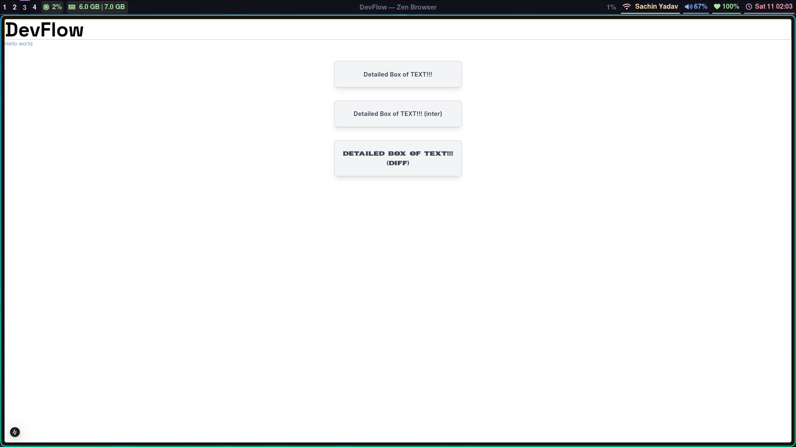

as of 14-4-2026 : shadcn and css theme making

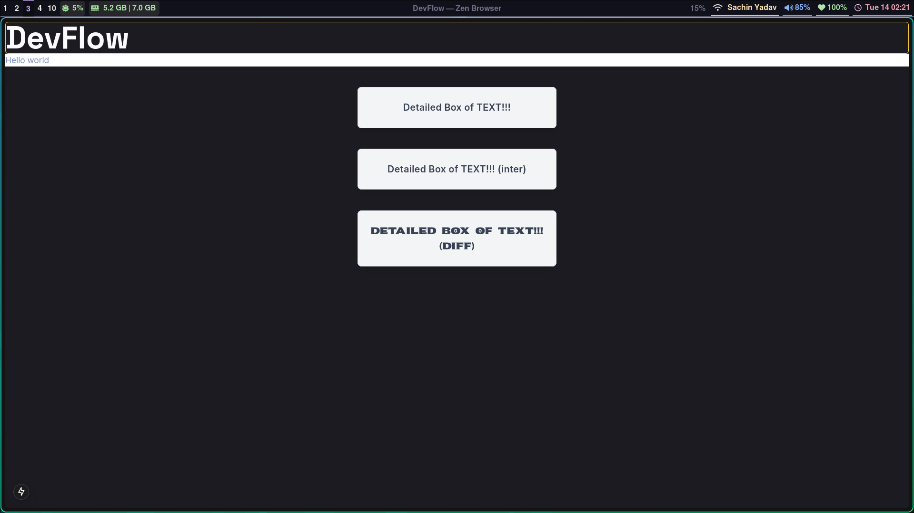

as of 15-4-2026 : Dark and light mode

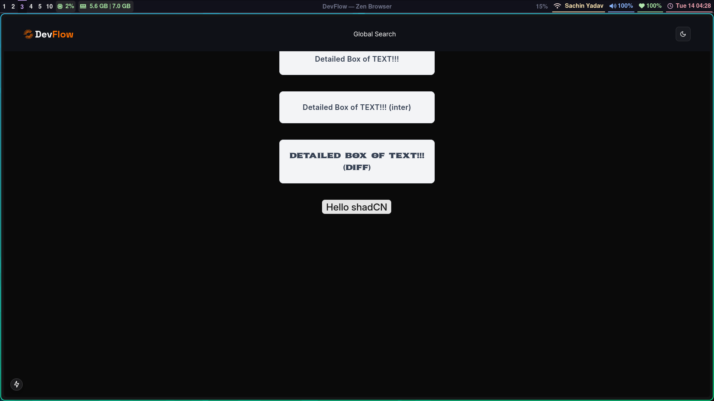

as of 17-4-2026 : Login page UI

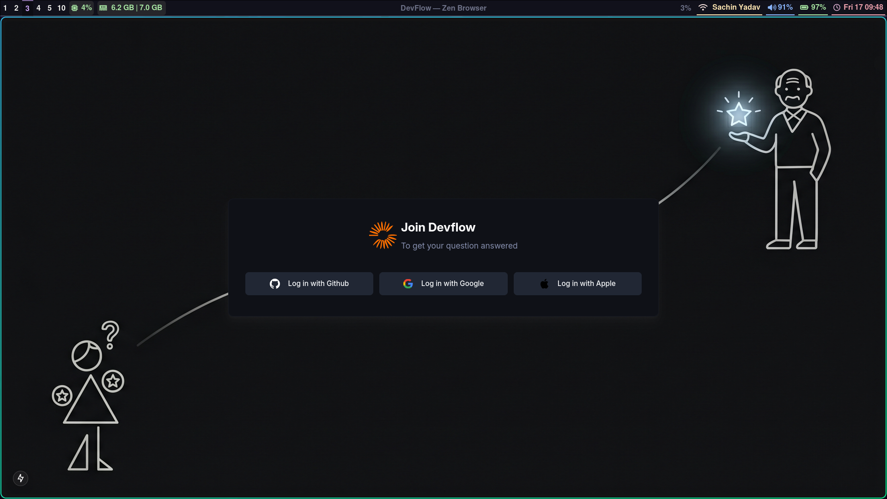

as of 19-4-2026 : Github and Google Auth

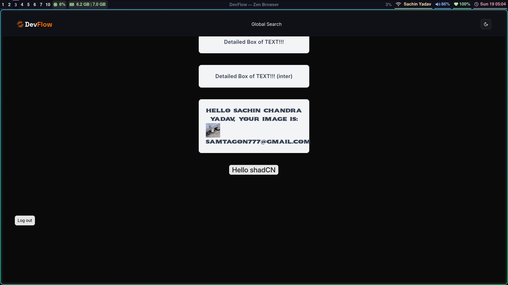  

as of 20-4-2026 : Email and password login form (sigin and signup)

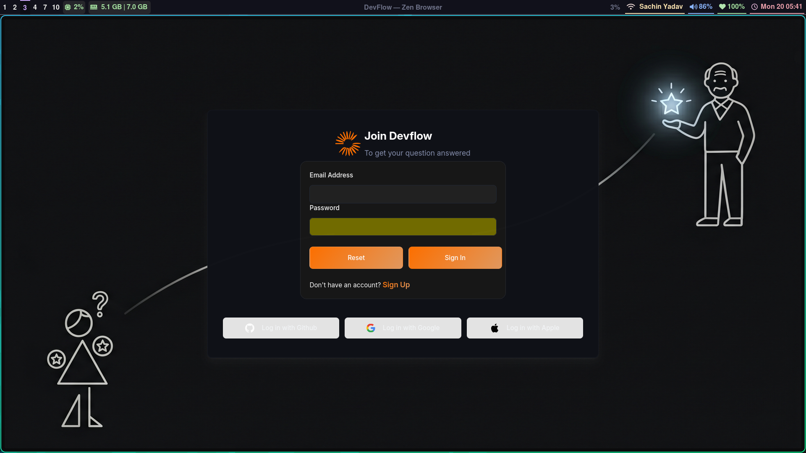  

as of 23-4-2026 : Mobile Navbar

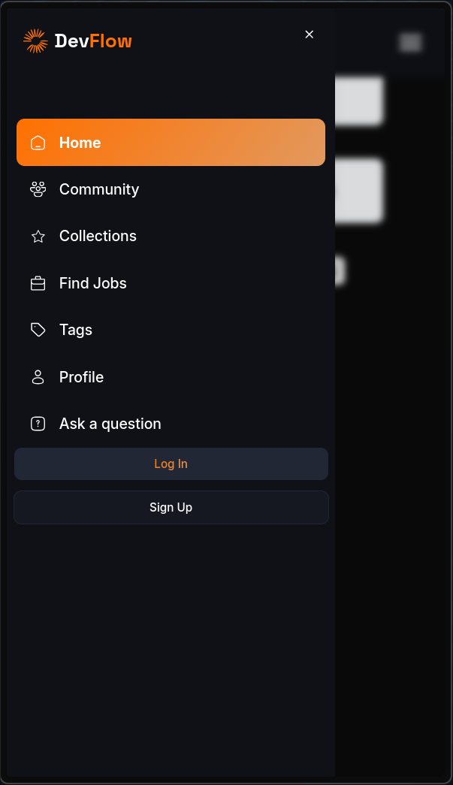  

as of 23-4-2026 : Leftsidebar and made it mobile,tablet and desktop responsive

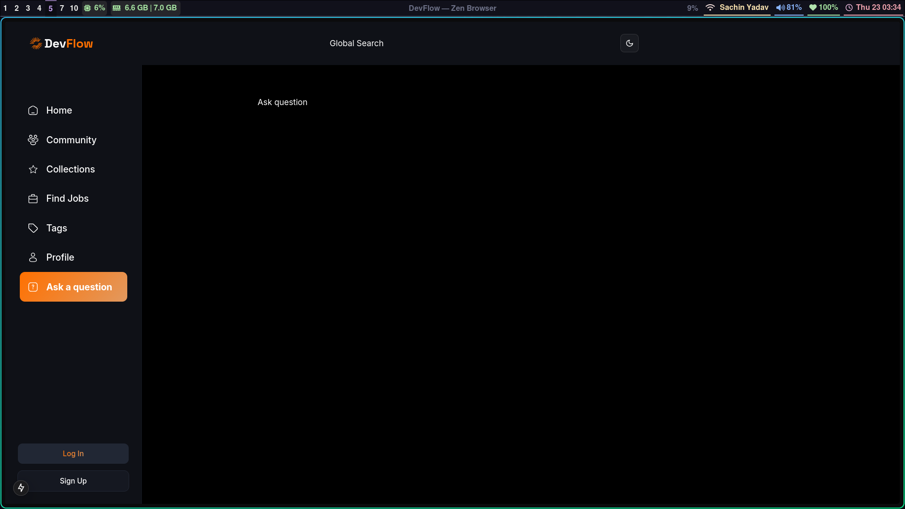  

as of 24-4-2026 : Rightsidebar which has top questions and popular tags

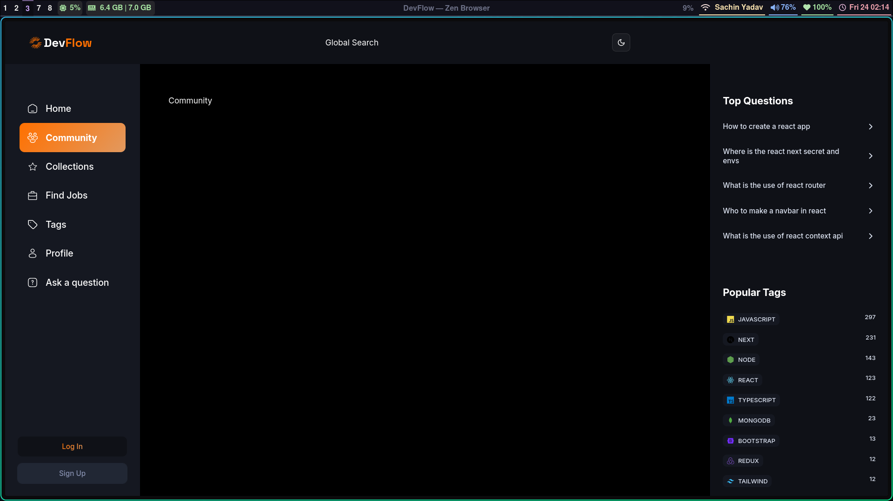  

as of 25-4-2026 : URL search query management and Local search on questions implemented

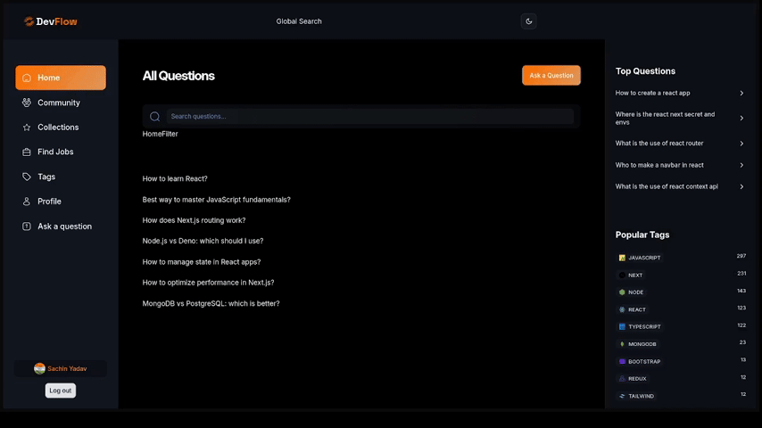

as of 25-4-2026 : Designed a question card

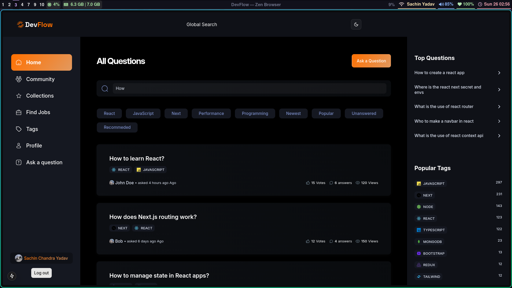  

as of 25-4-2026 : Made a ask question form using react-hook-form and MDX-Editor for full styling support for question description

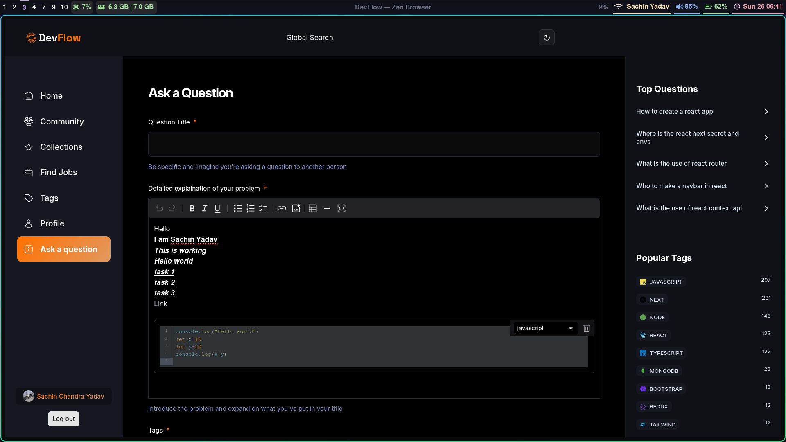  
